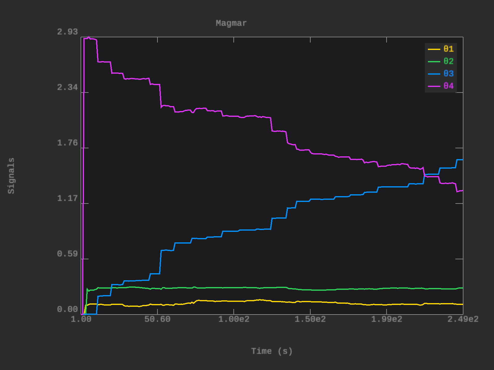
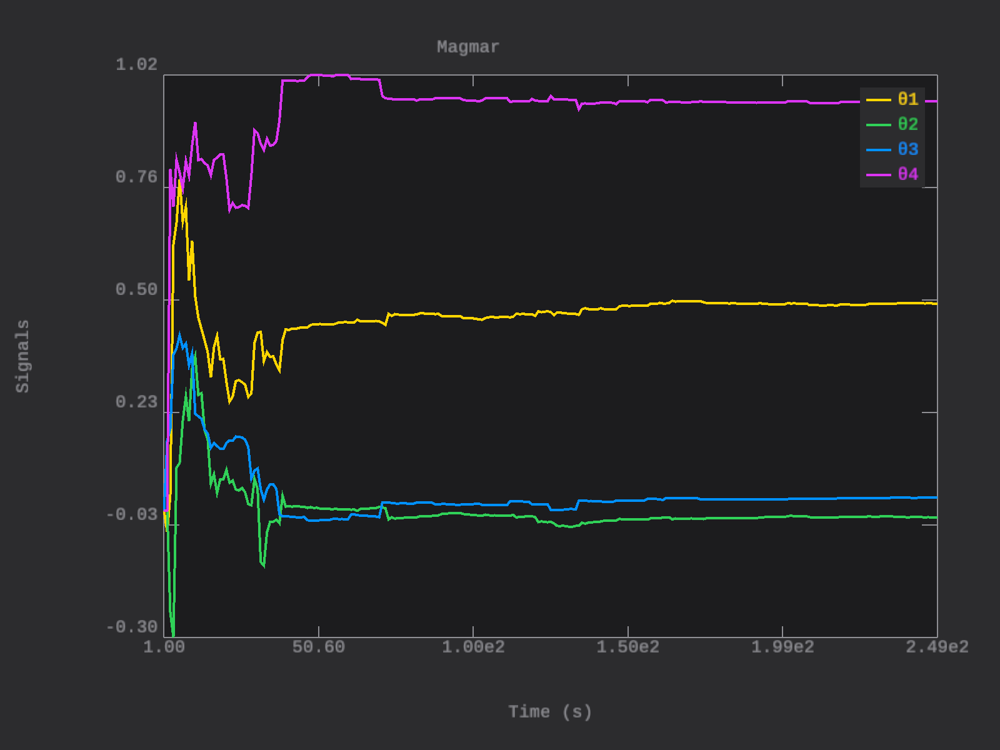

# Laboratório 2 — Identificação de Sistemas

Trabalho de laboratório da disciplina **PPGI068 - Introdução à Identificação de Sistemas Dinâmicos**, do Mestrado em Informática. Implementa em Rust a análise e identificação de sistemas de controle, abordando desde o estudo de sistemas contínuos até a identificação recursiva de modelos ARX e ARMAX a partir de dados experimentais.

## Como executar

```bash
cargo run
```

A execução imprime os resultados de todas as seis questões em `stdout` e salva os gráficos em `images/`.

## Estrutura

- `src/system/` — definição dos dois sistemas contínuos analisados (primeiro e segundo)
- `src/diff_eq.rs` — equação a diferenças (block DSP) para simulação
- `src/ordinary_least_squares.rs` — identificação por EMQ em lote (ARX/ARMAX)
- `src/recursive_least_squares.rs` — RLS (ARX recursivo)
- `src/recursive_extended_least_squares.rs` — RELS (ARMAX recursivo)
- `src/questions/questionN.rs` — implementação de cada questão
- `samples/dados_N.csv` — datasets experimentais

## Sistemas analisados

**Primeiro sistema** (3ª ordem, subamortecido):
- Polos: `r₁ = -1`, `r₂ = -1+i`, `r₃ = -1-i`
- Frequências naturais: `ωₙ = 1, √2, √2`
- Amortecimentos: `ζ = 1, 0.707, 0.707`
- Estável

**Segundo sistema** (2ª ordem, subamortecido):
- Polos: `r₁ = -0.5+1.5i`, `r₂ = -0.5-1.5i`
- Frequência natural: `ωₙ = √2.5 ≈ 1.58`
- Amortecimento: `ζ ≈ 0.316`
- Estável, com oscilações visíveis


## Questão 1 — Discretização e análise de polos

Para cada sistema:
1. Resposta ao degrau contínua e análise de polos (estabilidade, amortecimento, frequência natural)
2. Discretização pelo método de Tustin (T = 0,1 s)
3. Verificação da equação a diferenças com simulação discreta

A equação a diferenças segue a convenção usada pela identificação OLS: o coeficiente `b₀` multiplica `u[k]` (entrada atual), `b₁` multiplica `u[k-1]`, etc.

**Exemplo — 1º sistema:**
```
y[k] = 2.71y[k-1] - 2.45y[k-2] + 0.74y[k-3] + 0.03u[k] - 0.02u[k-1] - 0.03u[k-2] + 0.02u[k-3]
```

## Questão 2 — Identificação por EMQ

Gerada simulação de 100 amostras com três cenários:
- Sem ruído
- Ruído gaussiano dinâmico (na equação)
- Ruído gaussiano de sensor (adicionado à saída)

Para cada cenário, ordens 1 a 5 são identificadas via `OrdinaryLeastSquares`. Resíduos são plotados e média impressa.

**100 repetições** para o modelo de 3ª ordem (ruído de sensor) retornam média e desvio padrão dos coeficientes identificados:

| Parâmetro | Média (1º sistema, Step) | Desvio Padrão |
|-----------|--------------------------|---------------|
| θ₁ (a₁)   | 0.290                    | 0.020         |
| θ₂ (a₂)   | 0.274                    | 0.029         |
| θ₃ (a₃)   | 0.270                    | 0.025         |
| θ₄ (b₀)   | 0.026                    | 0.003         |
| θ₅ (b₁)   | 0.044                    | 0.016         |
| θ₆ (b₂)   | 0.099                    | 0.018         |
| θ₇ (c₀)   | 1.018                    | 0.055         |

## Questão 3 — Validação dos modelos

Para cada cenário da questão 2, um **novo conjunto de dados** é gerado (mesma configuração, ruído aleatório independente) e usado para **validação** dos modelos já identificados. Métricas calculadas sobre o conjunto de validação:

- **SSE** (Sum of Squared Errors)
- **R** (coeficiente de correlação múltipla = √R²)
- **SNR** em dB, calculada como `10·log₁₀(Σy²/Σ(y-ŷ)²)`

Exemplo — 1º sistema com ruído dinâmico, avaliação na validação:

| Ordem | SSE        | R       | SNR (dB) |
|-------|------------|---------|----------|
| 1     | 2000.28    | N/A     | 0.95     |
| 2     | 2219.31    | N/A     | 0.50     |
| 3     | 3.85       | 0.9988  | 28.1     |
| 4     | ≈ 0        | 1.0000  | 182.1    |
| 5     | ≈ 0        | 1.0000  | 165.3    |

A 4ª ordem fornece o melhor ajuste — a ordem real do sistema discreto é 3, mas ordens um pouco acima capturam a dinâmica de forma robusta.

## Questão 4 — Identificação ARX e ARMAX em dados experimentais

Datasets: `samples/dados_1.csv` e `samples/dados_2.csv`.

Procedimento:
1. **Split 50/50** dos dados em estimação e validação
2. Para cada ordem (1 a 5), identifica ARX e ARMAX via OLS
3. **ARMAX**: ruído aproximado pelos resíduos do ARX correspondente (abordagem iterativa)
4. MSE calculada sobre o conjunto de validação

### dados_1.csv
| Ordem | ARX MSE | ARMAX MSE |
|-------|---------|-----------|
| 1     | 0.01545 | 0.01157   |
| 2     | 0.01207 | 0.00013   |
| 3     | 0.01141 | 0.00010   |
| 4     | 0.01129 | **0.0000000049** |
| 5     | 0.01124 | 0.00000092 |

**Selecionado: ARMAX ordem 4** (MSE = 4,9×10⁻⁹) — ARMAX supera ARX em ordens de magnitude.

### dados_2.csv
| Ordem | ARX MSE | ARMAX MSE |
|-------|---------|-----------|
| 1     | 0.18233 | 0.00801   |
| 2     | 0.19391 | **0.00000015** |
| 3     | 0.16983 | 0.00001   |
| 4     | 0.15480 | 0.00002   |
| 5     | 0.15051 | 0.00003   |

**Selecionado: ARMAX ordem 2** (MSE = 1,5×10⁻⁷).

## Questão 5 — Identificação recursiva (RLS/RELS)

Datasets: `samples/dados_3.csv` e `samples/dados_4.csv`.

- **ARX via RLS**: identifica coeficientes a, b dinamicamente
- **ARMAX via RELS**: identifica a, b, c (ruído estimado internamente como resíduo)

### dados_3.csv (sistema VARIANTE NO TEMPO)
| Ordem | ARX MSE | ARMAX MSE |
|-------|---------|-----------|
| 1     | 0.16588 | 0.14554   |
| 2     | 2.03138 | 2.16663   |
| 3     | 2.71593 | 2.88313   |
| 4     | 2.41084 | 2.73299   |
| 5     | 4.86897 | 5.18705   |

**Conclusão**: os parâmetros identificados pelo RLS/RELS **não convergem** ao longo das 250 amostras — continuam se ajustando até o fim (veja `images/RLS_ARX_dados3_*.png`). Isso indica dinâmica que muda ao longo do tempo.



### dados_4.csv (sistema INVARIANTE NO TEMPO)
| Ordem | ARX MSE | ARMAX MSE |
|-------|---------|-----------|
| 1     | 0.39159 | 1.28293   |
| 2     | 1.54382 | **0.26978** |
| 3     | 0.46879 | 0.33656   |
| 4     | 0.48697 | 0.55303   |
| 5     | 0.49182 | 0.55106   |

**Conclusão**: os parâmetros convergem após ~50 amostras e permanecem estáveis. Dinâmica fixa.



## Questão 6 — Seleção por AIC e BIC

Datasets: `samples/dados_5.csv` e `samples/dados_6.csv`. Identificação ARMAX via RELS, com separação estimação/validação (50/50). Ordem escolhida pelos critérios AIC e BIC, que penalizam complexidade:
- `AIC = 2k + N·ln(SSE)`
- `BIC = k·ln(N) + N·ln(SSE)` (penaliza mais a complexidade)

Contagem de parâmetros: `k = 3·ordem` (para ARMAX).

### dados_5.csv
| Ordem | SSE       | AIC     | BIC     |
|-------|-----------|---------|---------|
| 1     | 245.10    | 2756.84 | 2769.48 |
| 2     | 171.98    | 2585.68 | 2610.97 |
| 3     | 136.27    | 2475.31 | 2513.24 |
| 4     | **113.23**| **2388.72** | **2439.30** |
| 5     | 256.33    | 2803.22 | 2866.44 |

**Selecionado: ordem 4** (minimiza tanto AIC quanto BIC). A ordem 5 já apresenta sobreajuste com SSE subindo.

### dados_6.csv
| Ordem | SSE       | AIC     | BIC     |
|-------|-----------|---------|---------|
| 1     | **105.84**| **1171.48** | **1182.05** |
| 2     | 134.72    | 1237.80 | 1258.93 |
| 3     | 319945.41 | 3186.98 | 3218.67 |
| 4     | 4,3×10⁵³  | 30899.86 | 30942.12 |
| 5     | 2,9×10⁸⁷  | 50379.61 | 50432.43 |

**Selecionado: ordem 1**. Ordens ≥ 3 produzem modelos numericamente instáveis — a dinâmica é simples e não comporta maior complexidade.

## Observações finais

- **Questão 1**: a convenção do `Display` da equação a diferenças foi alinhada com a da simulação e identificação (índices de `u[k]`, `e[k]` a partir de zero).
- **Questão 3**: usa validação em dataset diferente, com coeficiente de correlação múltipla (não R²) e SNR como razão entre potências.
- **Questão 4**: resíduos do ARX são usados como estimativa de ruído para o ARMAX (em vez de gerar ruído artificial).
- **Questões 5/6**: o bug do regressor recursivo (que tornava `phi` circular — incluindo `y[k]` atual) foi corrigido em `recursive_least_squares.rs` e `recursive_extended_least_squares.rs`. Agora o RLS/RELS estima corretamente a dinâmica do sistema.
